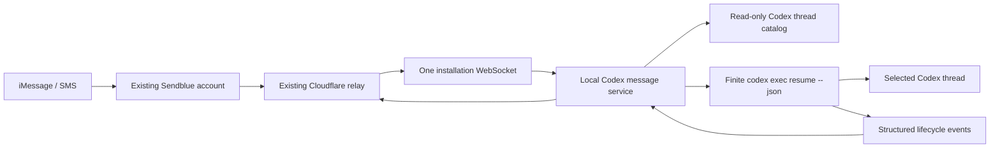

# Codex iMessage Service

## Product and implementation plan

This alternate version replaces the skill and per-thread Stop hooks with one
user-level local service. It preserves the current Cloudflare relay, Sendblue
account, phone number, webhook, install token, and pairing.

The redesign has two equally important goals:

1. Any visible, unarchived local Codex thread can be reached from one iMessage
   conversation without enabling it first.
2. The conversation feels like a small, coherent Codex client—not a terminal
   protocol exposed through text messages.

No additional third-party service, account, credential, webhook, or manual
provider configuration is required.

## Product principles

### The service owns the interface

Codex should receive the user's actual message, not instructions about how to
behave over iMessage.

The service must not insert:

- hook prompts;
- synthetic system instructions;
- local display blocks;
- formatting instructions;
- progress-update commands;
- pairing or delivery details; or
- instructions to repeat or suppress parts of the user's message.

For a text-only message, the exact inbound text is passed to the selected Codex
thread through stdin. Images are attached with supported Codex CLI image flags.
The resulting user turn and assistant answer remain normal, clean Codex history.

Navigation, typing, progress, context labels, menus, delivery, and errors are
service behavior. The model is never asked to implement the transport UI.

### Every outbound message has a clear source

The user must be able to distinguish three message classes immediately:

- **Thread output** — content produced by a specific Codex thread.
- **Service state** — connection, switching, queueing, cancellation, or errors.
- **Menus** — choices or short command help that require user input.

The distinction is made by a compact semantic header generated outside the
model. Unicode structure and a small symbol vocabulary improve scanning without
pretending that plain text is rich text. Every symbol is paired with a word, and
words stay in normal Unicode letters rather than faux mathematical bold.

Every task receives one stable object emoji derived deterministically from its
canonical thread ID. The emoji is identity, not state: it follows the task
through menus, switches, live updates, results, and background completions.

### Quiet by default

- Use the native typing indicator instead of sending “working” messages for
  ordinary turns.
- Show commands only when requested or when the user needs to make a choice.
- Do not append general help text to normal thread responses.
- Append the compact active-context footer to every outbound part so a user can
  always tell where the next ordinary message will go.
- Do not announce internal reconnects, catalog syncs, retries, or process IDs.
- Send progress only for materially long work and only when state has changed.
- Keep failures actionable and specific.

### Plain-text first

Formatting must remain readable in iMessage and SMS fallback. It cannot depend
on Markdown rendering, custom fonts, reactions, carousels, or link previews.
Rich media can enhance a result but cannot be required to understand or control
the service.

## Conversation language

### Header grammar

Use one consistent natural-case masthead. The leading symbol conveys category
at a glance, while the following words preserve the meaning in every client:

```text
✓ CODEX · Result
◆ CODEX · Threads
↪ CODEX · Context Switched
◷ CODEX · Pending
▲ CODEX · Needs Attention
```

Use symbols deliberately: `✓` completed or connected, `◆` neutral views, `↪`
context changes, `●` active work, `◷` pending work, `○` idle, `▲` attention,
and `×` cancellation or disconnection. Never show a symbol without its text
label. Keep actual words in natural case; do not substitute mathematical
alphanumeric glyphs to simulate bold.

Headers are rendered by the presentation layer after model execution. They are
never stored in Codex conversation history.

Every task reference starts with its stable generated object emoji. The footer
is the only restrained rule and always names the selected destination:

```text
────────────
⌁ Active context
Music crawler › 🧭 Fix album metadata
```

Use `Now active` after an intentional switch and `Active context unchanged`
for notifications about connectivity or a different task. If nothing is
selected, render `⌁ No active task · /threads` instead.

### Thread output

```text
↪ CODEX · Context Switched

🧭 Fix album metadata
Music crawler

New messages now go to this task.

Commands
/thread · /threads

────────────
⌁ Now active
Music crawler › 🧭 Fix album metadata
```

The result view uses the same identity:

```text
✓ CODEX · Result

🧭 Fix album metadata
Music crawler

The scraper now retries failed artist pages and all 42 tests pass.

────────────
⌁ Active context
Music crawler › 🧭 Fix album metadata
```

The assistant body is otherwise unchanged except for surrounding-whitespace
normalization and message-length splitting. Plain-text hierarchy is transport
chrome and is never injected into the Codex task.

If a response requires multiple bubbles, every part repeats both its part count
and its context footer:

```text
✓ CODEX · Result · 2/3

…continued response…

────────────
⌁ Active context
Music crawler › 🧭 Fix album metadata
```

Live mirroring stays conversational instead of repeating a full masthead on
every update. The speaker, phase, and provenance remain explicit:

```text
You · Mirrored from Mac · now

Please rerun the tests after that change.

────────────
⌁ Active context
Music crawler › 🧭 Fix album metadata
```

```text
Codex · Update · now

I found the failing assertion and I’m checking its callers.

────────────
⌁ Active context
Music crawler › 🧭 Fix album metadata
```

A background completion names both the source task and the still-selected
destination. It must not imply that completing another task changed context:

```text
✓ CODEX · Completed Elsewhere

📦 Retry failed imports
Music crawler
✓ Completed · now

All import checks pass.

────────────
⌁ Active context unchanged
Music crawler › 🧭 Fix album metadata
```

### Thread menu

```text
◆ CODEX · Threads

12 tasks · pending + activity in last 48h · updated now

▾ Music crawler · 2 tasks

1  🧭 Fix album metadata
   ⌁ Active · ○ Idle · 5m ago
   “Normalize the album dates.”

2  📦 Retry failed imports
   ● Working · for 2m
   “Retry the failed artist imports.”

▾ iMessage handoff · 1 task

3  📐 Improve thread menu
   ◷ Pending · waiting 1m
   “Improve message hierarchy.”

Recent projects

4  ▸ Portfolio · 4 tasks
   ○ Idle · 1h ago

Reply
Reply with a number to open.

Commands
/refresh · /projects · /search

────────────
⌁ Active context
Music crawler › 🧭 Fix album metadata
```

The menu is a stable snapshot. Its numbering must not reorder while the user is
choosing. A snapshot expires after ten minutes; an expired selection asks the
local service for a fresh menu rather than switching to the wrong thread.

Build the directory locally on demand. For each project, show every task with
pending work first, then every remaining task whose actual latest rollout turn
is within 48 hours. Omit projects without a qualifying task. Codex tasks listed
in `projectless-thread-ids` share a final `Other tasks` section. Every task row
shows a short, single-line preview of its newest user request. Send that preview
transiently for delivery and persist only the ordered task IDs used by numeric
selection.

Do not show raw thread IDs, full filesystem paths, model names, or timestamps
unless the user explicitly asks for diagnostic information.

### Context switch

```text
◆ CODEX · Thread

🧭 Fix album metadata
Music crawler

○ Idle · 5m ago · Reasoning: High

Commands
/request · /turn · /history · /reasoning

You · 7m ago
Please normalize the album metadata…

Note · /request shows the full message.

Codex · Result · 5m ago
The complete final response from the last turn appears here.

────────────
⌁ Active context
Music crawler › 🧭 Fix album metadata
```

The second line is a short project label only when it disambiguates the thread.
Switching does not run Codex and does not generate a model response. It reads
the selected rollout locally: idle tasks show the complete final response from
the last turn; working tasks show the latest request and every user-visible
assistant message produced in the current turn so far.

If the user sends `2: run the tests` from an active menu, the service switches
to item 2 and submits `run the tests` in one action. This shortcut is documented
only in `/help` initially, not in every thread menu.

### Connection and first use

Existing paired users see one migration confirmation:

```text
◆ CODEX · Connected

iMessage is linked to Codex on Alex’s Mac.
12 recent threads are available.

Text /threads to choose one.

────────────
⌁ No active task · /threads
```

Fresh installs retain the current six-character pairing flow. After the code is
accepted, the same `Connected` message is used. Pairing codes, relay URLs,
tokens, hook details, and setup commands are not mixed into normal conversation.

### Progress

For normal work, send a read receipt and start the native typing indicator. No
progress bubble is necessary.

For longer work, the service may send:

```text
● CODEX · Still Working

Running the test suite after updating the retry logic.

────────────
⌁ Active context
Music crawler › 🧭 Fix album metadata
```

Progress policy:

- start typing immediately after a reply is claimed;
- refresh or stop typing according to Sendblue limits;
- send no progress bubble during the first 30 seconds;
- after 30 seconds, send an update only when a safe, observable phase changes;
- rate-limit repeated phases and omit irrelevant intermediate steps;
- never expose chain-of-thought, raw shell commands, secrets, URLs containing
  tokens, or unredacted tool output;
- `/status` may return the current safe phase immediately;
- always stop typing on success, failure, cancellation, or process exit.

Progress text is deterministic and generated from structured Codex JSONL event
categories. It is not authored by a hidden model prompt.

### Queue and busy state

```text
◷ CODEX · Pending

About
🧭 Fix album metadata
Music crawler

Details
This task is already running in Codex.
Your message will start when it is available.

────────────
⌁ Active context
Music crawler › 🧭 Fix album metadata
```

Only send this when execution cannot begin promptly. Claim each notified relay
reply immediately into the service's private durable queue before it waits for
an execution slot. A user can inspect it with `/status` or remove it with
`/cancel`.

### Cancellation

```text
× CODEX · Cancelled

About
🧭 Fix album metadata
Music crawler

Details
The run stopped at your request.

────────────
⌁ Active context
Music crawler › 🧭 Fix album metadata
```

If nothing is running:

```text
▲ CODEX · Needs Attention

Details
There is no active Codex run to cancel.

────────────
⌁ Active context
Music crawler › 🧭 Fix album metadata
```

### Errors

Errors use `Needs Attention`, a one-sentence explanation, and one next action.

```text
▲ CODEX · Needs Attention

Details
The selected task no longer exists on this Mac.

Commands
/threads · Choose another task

────────────
⌁ No active task · /threads
```

Do not expose stack traces, HTTP codes, database terminology, Cloudflare
details, or child-process output in normal messages. Diagnostics remain local
and redacted.

### Commands

Commands use a `/` prefix so ordinary messages such as “status” or “threads” can
still be sent naturally to Codex. Continue accepting the old bare `threads`
command as a compatibility alias.

Initial commands:

```text
/threads          pending tasks plus turns from the last 48 hours
/recent           compatibility alias for /threads
/search words     find threads by title or project
/projects         browse by project
/refresh          rebuild the grouped directory
/thread           selected task and current/last turn
/request          complete latest user request
/turn             complete current or last turn
/history [count]  completed request/final-response history
/reasoning [level] inspect or set the next iMessage turn's reasoning
/status           alias for /thread
/retry            retry the last failed iMessage request
/dismiss          dismiss the oldest failed iMessage request
/cancel           cancel the service-owned run or queued message
/help             command summary
```

`/help` renders:

```text
◆ CODEX · Commands

Browse
/threads · Tasks by project
/refresh · Refresh the task list
/search words · Find a task
/projects · Browse all projects

Active task
/thread · Status and latest response
/request · Full latest request
/turn · Current or last turn
/history 3 · Completed turn history
/reasoning · View or change reasoning

Work
/cancel · Stop iMessage-started work
/retry · Retry the oldest failed request
/dismiss · Clear the oldest failed request

Menu replies
In a thread menu, reply with a number to switch.
You can also send “2: your message” to switch and continue.

────────────
⌁ Active context
Music crawler › 🧭 Fix album metadata
```

Unknown `/commands` show a concise correction and this menu. Unknown ordinary
text always goes to the selected Codex thread.

## Interaction state machine


Important parsing rules:

1. Slash commands are parsed before thread input.
2. A bare number is a selection only while a valid menu snapshot exists.
3. `<number>: <message>` is special only while that snapshot exists.
4. Otherwise, the complete text is passed unchanged to the selected thread.
5. Service messages never enter Codex history.

## Architecture



### Local service

Add a `service/` TypeScript workspace package for Node 20+.

Responsibilities:

- run as a user service, never as a Codex skill or hook;
- read the Codex thread catalog in read-only mode;
- synchronize visible, unarchived metadata with the relay;
- maintain one authenticated installation WebSocket;
- validate and lease inbound work;
- resolve the destination thread and working directory locally;
- download bounded image attachments to private local state;
- pass the exact user text over stdin to:

  ```text
  codex exec resume --json --output-last-message <temporary-file> <thread-id> -
  ```

- attach images with repeated supported image arguments;
- parse lifecycle events without copying private tool output into logs;
- publish typed progress, completion, cancellation, and failure events;
- exit each Codex child process after the turn completes; and
- remain as a small idle event listener between requests.

The Codex boundary is isolated behind an adapter:

```ts
interface CodexAdapter {
  listThreads(): Promise<CodexThreadSummary[]>;
  getThread(id: string): Promise<CodexThreadSummary | null>;
  isRunnable(id: string): Promise<boolean>;
  resume(request: ResumeRequest): AsyncIterable<CodexRunEvent>;
}
```

### Presentation layer

Add a shared, pure presentation module consumed by the relay and local service:

```text
protocol/
  messages.ts
  presentation.ts
  schemas/
```

Logical outbound events are typed rather than preformatted strings:

```ts
type OutboundEvent =
  | { kind: "thread.output"; thread: ThreadLabel; body: string }
  | { kind: "thread.progress"; thread: ThreadLabel; phase: SafePhase }
  | { kind: "service.menu"; menu: MenuSnapshot }
  | { kind: "service.switched"; thread: ThreadLabel }
  | { kind: "service.notice"; code: NoticeCode; detail?: string };
```

The relay renders the final Sendblue payload. This ensures pairing messages,
menus, progress, and thread output use one grammar. Snapshot tests cover every
message in both iMessage and SMS-safe form.

Model output is data inside `thread.output`; it can never choose a service
header or imitate a control message through transport metadata.

### Relay protocol

Keep the existing webhook and thread data plane. Add:

```text
POST /service/register
PUT  /service/catalog
GET  /service/events                 WebSocket
GET  /service/status
POST /service/events/outbound
```

All routes use the existing bearer install token.

- `register` advertises client capabilities and returns pairing state.
- `catalog` synchronizes bounded thread and project labels without conversation
  content, previews, full paths, or git remotes.
- `events` emits IDs and routing metadata, not prompt bodies.
- existing authenticated claim endpoints return prompt/media only when the
  service is ready to run them.
- `events/outbound` accepts typed presentation events and applies rate limits,
  authorization, formatting, splitting, and Sendblue delivery.

Retain these existing execution routes during migration:

```text
POST /threads/:threadId/replies/:replyId/claim
POST /threads/:threadId/status
GET  /threads/:threadId
POST /threads/:threadId/stop
```

### Relay state

Extend the Durable Object with owner-level subscribers. Notify one installation
socket when a reply is buffered for any thread. Existing thread sockets remain
only as a temporary compatibility path.

Inbound message bodies stay in the in-memory reply buffer only until the live
service immediately claims and saves them privately, then are scrubbed. D1
stores routing and presentation metadata only.

Add metadata tables for service installations, installation-level pairing, and
stable menu snapshots. Extend thread rows with catalog visibility, project
label, and last-seen timestamps. Preserve existing phone bindings so paired
users do not re-pair.

## Thread discovery

Default scope is all visible, unarchived local Codex threads. No opt-in per
thread is required.

Catalog rules:

- synchronize title, short project label, created/updated time, visibility, and
  archived state;
- keep full paths and conversation previews out of D1; read previews locally
  only for an on-demand directory;
- include all tasks with pending work, then turns from the last 48 hours;
- remove spawned subagent sessions using `thread_spawn_edges` plus legacy
  source fallbacks;
- deduplicate strictly by canonical thread ID and never by title or path;
- group project tasks using Codex's `thread-workspace-root-hints` and collect
  `projectless-thread-ids` into one final Other tasks section;
- exclude empty placeholder sessions;
- hide catalog rows omitted by each complete replacement snapshot;
- support up to 500 top-level recent tasks;
- paginate and search locally before returning compact menus.

Selecting a thread updates the existing phone binding's active thread. Catalog
refreshes never change selection.

## Execution and concurrency

- One active remote turn per thread.
- A small installation-wide concurrency bound permits distinct tasks to run
  together while preserving one active turn per task.
- Messages remain queued in the relay until leased.
- Service-owned locks prevent duplicate local execution.
- Codex lock/conflict exits are classified as busy, not model failures.
- A local desktop turn always takes precedence; remote work waits rather than
  launching a competing turn.
- `/cancel` terminates only the service-owned child process and never archives,
  deletes, or rewrites a thread.
- Relay event IDs and Sendblue external IDs provide idempotency across retries.

If Codex later provides a supported local task API, implement it as a preferred
adapter while retaining CLI fallback.

## Installation and migration

The CLI becomes service-oriented:

```text
imessage-handoff service install
imessage-handoff service start
imessage-handoff service stop
imessage-handoff service status
imessage-handoff service pause
imessage-handoff service uninstall
```

On macOS, `install` creates a user LaunchAgent with no root privileges. A
foreground `service run` command supports development.

Upgrade flow:

1. Import the existing relay URL and install token.
2. Confirm the existing phone binding and pairing.
3. Start the service and establish its owner-level WebSocket.
4. Synchronize the initial thread catalog.
5. Switch the owner to service delivery.
6. Remove the old iMessage Handoff Stop hook.
7. Remove hook-specific active-thread state and helper prompting scripts after
   the rollback window.

Do not keep a permanent dual-delivery design. A short migration window may
retain legacy endpoints, but the target installation contains no Stop hook,
`publish-stop.js`, `send-update.js`, active-hook state, or skill instructions.

Self-hosted users apply the included D1 migration and deploy the updated Worker.
Their database, domain, Sendblue credentials, webhook URL, number, install token,
and phone pairing remain unchanged.

## Security and privacy

- Preserve install-token authentication and the Sendblue webhook secret.
- Store tokens, locks, temporary results, and media with owner-only permissions.
- Validate thread IDs against the local read-only catalog.
- Derive working directories locally, never from an inbound relay message.
- Pass user text through stdin, never process arguments.
- Bound media size, count, type, and download time.
- Never log prompt bodies, assistant bodies, tokens, media URLs, or raw JSONL
  tool payloads.
- Rate-limit control messages and progress independently from final results.
- A per-task reasoning override may be set for the next iMessage-started turn.
  It is private local service state and is passed as an invocation override;
  Codex SQLite and global config are never edited.
- Do not expose remote controls for model, sandbox, approval mode, project
  rules, task deletion, or task archival.
- Preserve each thread's normal Codex configuration.
- Support local pause, token reset, phone revocation, uninstall, and rollback.

## Repository shape

```text
service/
  src/
    codex/
      adapter.ts
      cli-adapter.ts
      state-store.ts
    relay/
      client.ts
    runner/
      queue.ts
      progress.ts
      turn-runner.ts
    platform/
      launchd.ts
      paths.ts
    cli.ts
    daemon.ts
  tests/
protocol/
  messages.ts
  presentation.ts
  schemas/
relay/
  src/
    worker.ts
    db/migrations/0005_service_installations.sql
```

## Implementation phases

### Phase 0: interaction contract

- Implement pure renderers for every message class in this document.
- Add golden transcript tests for pairing, menus, switching, ordinary replies,
  long replies, progress, queueing, cancellation, and errors.
- Add parsing tests proving ordinary user text is never mistaken for a command
  outside a valid menu state.
- Add a test proving the exact inbound user body—not a wrapped prompt—reaches
  the Codex adapter.

Exit criterion: the full conversation can be reviewed from fixtures without a
live relay or model.

### Phase 1: local foreground service

- Implement read-only catalog discovery.
- Implement finite `codex exec resume --json` execution.
- Implement leases, locks, attachments, cancellation, and redacted logs.
- Map stable JSONL lifecycle events to safe progress phases.
- Run against a mocked installation event stream.

Exit criterion: a mocked iMessage event creates one clean Codex user turn, one
normal assistant turn, and one formatted outbound thread response.

### Phase 2: installation-level relay

- Add service registration, catalog sync, pairing, owner WebSocket, menu
  snapshots, typed outbound events, and presentation rendering.
- Reuse existing claim, phone binding, Sendblue webhook, and status delivery.
- Add thread menu/search/project commands and deterministic selection parsing.

Exit criterion: one connection routes messages to multiple threads and every
outbound bubble matches a golden presentation fixture.

### Phase 3: end-to-end behavior

- Connect the real local service and relay.
- Implement read receipts, typing lifecycle, bounded progress, final output,
  images, cancellation, offline recovery, and deduplication.
- Test desktop/local collision and queued remote work.

Exit criterion: multiple threads can be used sequentially without a hook, and
short tasks produce only typing plus the final response.

### Phase 4: installer and clean migration

- Add LaunchAgent install/status/pause/uninstall commands.
- Import current config and pairing automatically.
- Remove the Stop hook only after service health is confirmed.
- Remove hook prompts and helper scripts from the target install.
- Document rollback without making legacy behavior part of the new UX.

Exit criterion: an existing paired installation upgrades without Sendblue or
Cloudflare configuration and without re-pairing.

### Phase 5: hardening

- Run 24-hour idle and reconnect tests.
- Validate resource and abuse limits.
- Test Codex schema/CLI drift through the adapter boundary.
- Review every user-facing string and golden transcript for clarity and noise.

## Test matrix

- Fresh pairing and existing paired migration.
- Hosted and self-hosted relay configurations.
- 1, 8, 25, 100, and 500 catalog tasks.
- Spawned-subagent filtering without title-based false deduplication.
- All pending tasks, exact 48-hour turn filtering, and a final Other tasks group.
- Duplicate titles across projects.
- Independently routable fork lineages with stable `Fork N` labels, plus
  stable labels for unrelated same-title sessions.
- Stable menu snapshots and expired selections.
- Slash commands versus identical ordinary words sent to Codex.
- Raw multiline text with no synthetic prompt wrapper.
- Text, image, grouped image, final text, and generated images.
- Short task with typing only.
- Long task with deterministic bounded progress.
- Success, model failure, tool failure, cancellation, and process crash.
- Service restart before lease, after lease, and after Codex completion.
- Duplicate webhook delivery and WebSocket reconnect.
- Same-thread and cross-thread queues.
- Immediate cancellation/control commands while other turns are running.
- Idle full-final, working current-turn, full-request, turn-history, and
  per-task reasoning views.
- Desktop-local activity colliding with a remote request.
- Archived, deleted, moved, and missing-directory threads.
- Token reset, phone revocation, pause, uninstall, and rollback.
- SMS-safe formatting and long-message splitting.
- Logs checked for prompt, response, token, media URL, and raw tool leakage.

## Early technical spikes

1. Verify `codex exec resume --json <thread-id> -` updates a desktop-created
   thread and document lock/conflict behavior.
2. Confirm which JSONL lifecycle events are stable enough for deterministic
   progress without exposing reasoning or sensitive tool data.
3. Verify generated-image discovery without scanning unrelated session files.
4. Test desktop-local turns while a service-owned resume is running.
5. Validate LaunchAgent PATH, Codex authentication, and `CODEX_HOME` inheritance
   without copying credentials.
6. Confirm Sendblue typing refresh/stop behavior and SMS fallback rendering.

## Definition of done

- No skill, Stop hook, synthetic hook prompt, display block, or model-authored
  progress helper is required.
- No Codex thread waits for iMessage input.
- One local service exposes all visible, unarchived threads by default.
- Existing Sendblue and Cloudflare configuration works unchanged.
- Existing install token and phone pairing migrate without re-pairing.
- Thread menus, project browsing, search, switching, and commands are concise
  and visually consistent.
- Every model response is labeled with its source thread outside Codex history.
- Every service message is visibly distinct from model output.
- Short tasks use native typing and a final response without extra chatter.
- Long tasks receive safe, deterministic, rate-limited progress.
- The exact user message reaches Codex without transport instructions.
- Installation, pause, cancellation, revocation, uninstall, and rollback are
  tested.
