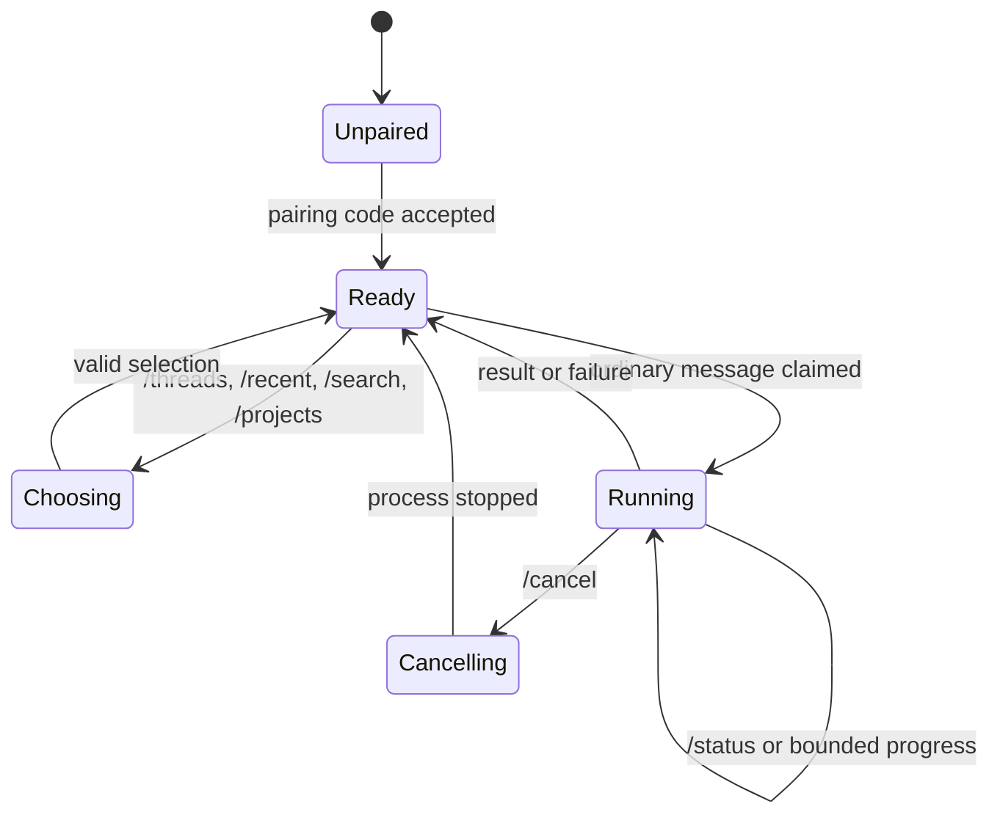
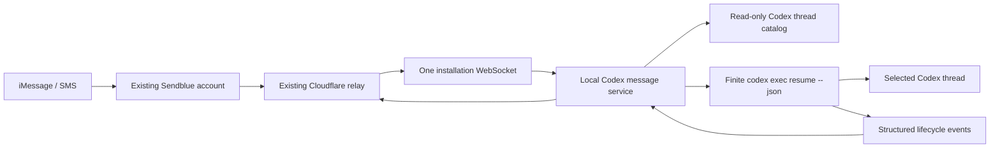

# Codex iMessage Service

## Product and implementation plan

This alternate version replaces the skill and per-thread Stop hooks with one
user-level local service. It preserves the current Cloudflare relay, Sendblue
account, phone number, webhook, install token, and pairing.

The redesign has two equally important goals:

1. Any visible, unarchived local Codex thread can be reached from one iMessage
   conversation without enabling it first.
2. The conversation feels like a small, coherent Codex client—not a terminal
   protocol exposed through text messages.

No additional third-party service, account, credential, webhook, or manual
provider configuration is required.

## Product principles

### The service owns the interface

Codex should receive the user's actual message, not instructions about how to
behave over iMessage.

The service must not insert:

- hook prompts;
- synthetic system instructions;
- local display blocks;
- formatting instructions;
- progress-update commands;
- pairing or delivery details; or
- instructions to repeat or suppress parts of the user's message.

For a text-only message, the exact inbound text is passed to the selected Codex
thread through stdin. Images are attached with supported Codex CLI image flags.
The resulting user turn and assistant answer remain normal, clean Codex history.

Navigation, typing, progress, context labels, menus, delivery, and errors are
service behavior. The model is never asked to implement the transport UI.

### Every outbound message has a clear source

The user must be able to distinguish three message classes immediately:

- **Thread output** — content produced by a specific Codex thread.
- **Service state** — connection, switching, queueing, cancellation, or errors.
- **Menus** — choices or short command help that require user input.

The distinction is made by a compact header generated outside the model. No
emoji, decorative boxes, signatures, or repeated instructional footers are used
by default.

### Quiet by default

- Use the native typing indicator instead of sending “working” messages for
  ordinary turns.
- Show commands only when requested or when the user needs to make a choice.
- Do not append help text to normal thread responses.
- Do not announce internal reconnects, catalog syncs, retries, or process IDs.
- Send progress only for materially long work and only when state has changed.
- Keep failures actionable and specific.

### Plain-text first

Formatting must remain readable in iMessage and SMS fallback. It cannot depend
on Markdown rendering, custom fonts, reactions, carousels, or link previews.
Rich media can enhance a result but cannot be required to understand or control
the service.

## Conversation language

### Header grammar

Use one consistent first line:

```text
CODEX · <LABEL>
```

Labels are short and meaningful:

- a thread title for model output;
- `THREADS`, `PROJECTS`, or `COMMANDS` for menus;
- `SWITCHED`, `CONNECTED`, `WORKING`, `QUEUED`, `CANCELLED`, or
  `NEEDS ATTENTION` for service messages.

Headers are rendered by the relay presentation layer after model execution.
They are never stored in Codex conversation history.

### Thread output

```text
CODEX · Music crawler

The scraper now retries failed artist pages and all 42 tests pass.
```

The assistant body is otherwise unchanged except for transport-safe conversion
of unsupported Markdown and message-length splitting.

If a response requires multiple bubbles, every continuation is identifiable:

```text
CODEX · Music crawler · 2/3
```

### Thread menu

```text
CODEX · THREADS

1  iMessage service redesign  • current
2  Music crawler
3  Portfolio refresh
4  Research notes

Reply with a number to switch.
```

The menu is a stable snapshot. Its numbering must not reorder while the user is
choosing. A snapshot expires after ten minutes; an expired selection returns a
fresh menu rather than switching to the wrong thread.

Show 8 threads initially. If more exist, end with one relevant note:

```text
More: /recent or /search words
```

Do not show raw thread IDs, full filesystem paths, model names, or timestamps
unless the user explicitly asks for diagnostic information.

### Context switch

```text
CODEX · SWITCHED

Music crawler
al-music-crawler

Send a message to continue this thread.
```

The second line is a short project label only when it disambiguates the thread.
Switching does not run Codex and does not generate a model response.

If the user sends `2: run the tests` from an active menu, the service switches
to item 2 and submits `run the tests` in one action. This shortcut is documented
only in `/help` initially, not in every thread menu.

### Connection and first use

Existing paired users see one migration confirmation:

```text
CODEX · CONNECTED

iMessage is linked to Codex on Alex’s Mac.
12 recent threads are available.

Text /threads to choose one.
```

Fresh installs retain the current six-character pairing flow. After the code is
accepted, the same `CONNECTED` message is used. Pairing codes, relay URLs,
tokens, hook details, and setup commands are not mixed into normal conversation.

### Progress

For normal work, send a read receipt and start the native typing indicator. No
progress bubble is necessary.

For longer work, the service may send:

```text
CODEX · WORKING

Music crawler
Running the test suite after updating the retry logic.
```

Progress policy:

- start typing immediately after a reply is claimed;
- refresh or stop typing according to Sendblue limits;
- send no progress bubble during the first 60 seconds;
- after 60 seconds, send an update only when a safe, observable phase changes;
- send at most one unsolicited update every two minutes;
- never expose chain-of-thought, raw shell commands, secrets, URLs containing
  tokens, or unredacted tool output;
- `/status` may return the current safe phase immediately;
- always stop typing on success, failure, cancellation, or process exit.

Progress text is deterministic and generated from structured Codex JSONL event
categories. It is not authored by a hidden model prompt.

### Queue and busy state

```text
CODEX · QUEUED

Music crawler is already running in Codex.
Your message will start when the thread is available.
```

Only send this when execution cannot begin promptly. Do not claim a relay reply
until the service can durably lease it. A user can inspect it with `/status` or
remove it with `/cancel`.

### Cancellation

```text
CODEX · CANCELLED

Music crawler stopped at your request.
```

If nothing is running:

```text
CODEX · NEEDS ATTENTION

There is no active Codex run to cancel.
```

### Errors

Errors use `NEEDS ATTENTION`, a one-sentence explanation, and one next action.

```text
CODEX · NEEDS ATTENTION

Music crawler no longer exists on this Mac.
Text /threads to choose another thread.
```

Do not expose stack traces, HTTP codes, database terminology, Cloudflare
details, or child-process output in normal messages. Diagnostics remain local
and redacted.

### Commands

Commands use a `/` prefix so ordinary messages such as “status” or “threads” can
still be sent naturally to Codex. Continue accepting the old bare `threads`
command as a compatibility alias.

Initial commands:

```text
/threads          recent threads
/recent           a longer recent-thread list
/search words     find threads by title or project
/projects         browse by project
/status           selected thread, run, and queue state
/cancel           cancel the service-owned run or queued message
/help             command summary
```

`/help` renders:

```text
CODEX · COMMANDS

/threads       Choose a recent thread
/search words  Find a thread
/projects      Browse by project
/status        Show current activity
/cancel        Stop current work

In a thread menu, reply with a number to switch.
You can also send “2: your message” to switch and continue.
```

Unknown `/commands` show a concise correction and this menu. Unknown ordinary
text always goes to the selected Codex thread.

## Interaction state machine



Important parsing rules:

1. Slash commands are parsed before thread input.
2. A bare number is a selection only while a valid menu snapshot exists.
3. `<number>: <message>` is special only while that snapshot exists.
4. Otherwise, the complete text is passed unchanged to the selected thread.
5. Service messages never enter Codex history.

## Architecture



### Local service

Add a `service/` TypeScript workspace package for Node 20+.

Responsibilities:

- run as a user service, never as a Codex skill or hook;
- read the Codex thread catalog in read-only mode;
- synchronize visible, unarchived metadata with the relay;
- maintain one authenticated installation WebSocket;
- validate and lease inbound work;
- resolve the destination thread and working directory locally;
- download bounded image attachments to private local state;
- pass the exact user text over stdin to:

  ```text
  codex exec resume --json --output-last-message <temporary-file> <thread-id> -
  ```

- attach images with repeated supported image arguments;
- parse lifecycle events without copying private tool output into logs;
- publish typed progress, completion, cancellation, and failure events;
- exit each Codex child process after the turn completes; and
- remain as a small idle event listener between requests.

The Codex boundary is isolated behind an adapter:

```ts
interface CodexAdapter {
  listThreads(): Promise<CodexThreadSummary[]>;
  getThread(id: string): Promise<CodexThreadSummary | null>;
  isRunnable(id: string): Promise<boolean>;
  resume(request: ResumeRequest): AsyncIterable<CodexRunEvent>;
}
```

### Presentation layer

Add a shared, pure presentation module consumed by the relay and local service:

```text
protocol/
  messages.ts
  presentation.ts
  schemas/
```

Logical outbound events are typed rather than preformatted strings:

```ts
type OutboundEvent =
  | { kind: "thread.output"; thread: ThreadLabel; body: string }
  | { kind: "thread.progress"; thread: ThreadLabel; phase: SafePhase }
  | { kind: "service.menu"; menu: MenuSnapshot }
  | { kind: "service.switched"; thread: ThreadLabel }
  | { kind: "service.notice"; code: NoticeCode; detail?: string };
```

The relay renders the final Sendblue payload. This ensures pairing messages,
menus, progress, and thread output use one grammar. Snapshot tests cover every
message in both iMessage and SMS-safe form.

Model output is data inside `thread.output`; it can never choose a service
header or imitate a control message through transport metadata.

### Relay protocol

Keep the existing webhook and thread data plane. Add:

```text
POST /service/register
PUT  /service/catalog
GET  /service/events                 WebSocket
GET  /service/status
POST /service/events/outbound
```

All routes use the existing bearer install token.

- `register` advertises client capabilities and returns pairing state.
- `catalog` synchronizes bounded thread and project labels without conversation
  content, previews, full paths, or git remotes.
- `events` emits IDs and routing metadata, not prompt bodies.
- existing authenticated claim endpoints return prompt/media only when the
  service is ready to run them.
- `events/outbound` accepts typed presentation events and applies rate limits,
  authorization, formatting, splitting, and Sendblue delivery.

Retain these existing execution routes during migration:

```text
POST /threads/:threadId/replies/:replyId/claim
POST /threads/:threadId/status
GET  /threads/:threadId
POST /threads/:threadId/stop
```

### Relay state

Extend the Durable Object with owner-level subscribers. Notify one installation
socket when a reply is buffered for any thread. Existing thread sockets remain
only as a temporary compatibility path.

Inbound message bodies stay in the in-memory reply buffer until claimed, then
are scrubbed. D1 stores routing and presentation metadata only.

Add metadata tables for service installations, installation-level pairing, and
stable menu snapshots. Extend thread rows with catalog visibility, project
label, and last-seen timestamps. Preserve existing phone bindings so paired
users do not re-pair.

## Thread discovery

Default scope is all visible, unarchived local Codex threads. No opt-in per
thread is required.

Catalog rules:

- synchronize title, short project label, created/updated time, visibility, and
  archived state;
- keep full paths and conversation previews local;
- show the most recently active threads first;
- group duplicate titles by project label;
- exclude empty placeholder sessions;
- remove deleted threads after a short grace period;
- support at least the 100 most recent threads initially;
- paginate and search locally before returning compact menus.

Selecting a thread updates the existing phone binding's active thread. Catalog
refreshes never change selection.

## Execution and concurrency

- One active remote turn per thread.
- One active Codex child process per installation by default.
- Messages remain queued in the relay until leased.
- Service-owned locks prevent duplicate local execution.
- Codex lock/conflict exits are classified as busy, not model failures.
- A local desktop turn always takes precedence; remote work waits rather than
  launching a competing turn.
- `/cancel` terminates only the service-owned child process and never archives,
  deletes, or rewrites a thread.
- Relay event IDs and Sendblue external IDs provide idempotency across retries.

If Codex later provides a supported local task API, implement it as a preferred
adapter while retaining CLI fallback.

## Installation and migration

The CLI becomes service-oriented:

```text
imessage-handoff service install
imessage-handoff service start
imessage-handoff service stop
imessage-handoff service status
imessage-handoff service pause
imessage-handoff service uninstall
```

On macOS, `install` creates a user LaunchAgent with no root privileges. A
foreground `service run` command supports development.

Upgrade flow:

1. Import the existing relay URL and install token.
2. Confirm the existing phone binding and pairing.
3. Start the service and establish its owner-level WebSocket.
4. Synchronize the initial thread catalog.
5. Switch the owner to service delivery.
6. Remove the old iMessage Handoff Stop hook.
7. Remove hook-specific active-thread state and helper prompting scripts after
   the rollback window.

Do not keep a permanent dual-delivery design. A short migration window may
retain legacy endpoints, but the target installation contains no Stop hook,
`publish-stop.js`, `send-update.js`, active-hook state, or skill instructions.

Self-hosted users apply the included D1 migration and deploy the updated Worker.
Their database, domain, Sendblue credentials, webhook URL, number, install token,
and phone pairing remain unchanged.

## Security and privacy

- Preserve install-token authentication and the Sendblue webhook secret.
- Store tokens, locks, temporary results, and media with owner-only permissions.
- Validate thread IDs against the local read-only catalog.
- Derive working directories locally, never from an inbound relay message.
- Pass user text through stdin, never process arguments.
- Bound media size, count, type, and download time.
- Never log prompt bodies, assistant bodies, tokens, media URLs, or raw JSONL
  tool payloads.
- Rate-limit control messages and progress independently from final results.
- Do not expose remote controls for model, reasoning, sandbox, approval mode,
  project rules, task deletion, or task archival in the first release.
- Preserve each thread's normal Codex configuration.
- Support local pause, token reset, phone revocation, uninstall, and rollback.

## Repository shape

```text
service/
  src/
    codex/
      adapter.ts
      cli-adapter.ts
      state-store.ts
    relay/
      client.ts
    runner/
      queue.ts
      progress.ts
      turn-runner.ts
    platform/
      launchd.ts
      paths.ts
    cli.ts
    daemon.ts
  tests/
protocol/
  messages.ts
  presentation.ts
  schemas/
relay/
  src/
    worker.ts
    db/migrations/0005_service_installations.sql
```

## Implementation phases

### Phase 0: interaction contract

- Implement pure renderers for every message class in this document.
- Add golden transcript tests for pairing, menus, switching, ordinary replies,
  long replies, progress, queueing, cancellation, and errors.
- Add parsing tests proving ordinary user text is never mistaken for a command
  outside a valid menu state.
- Add a test proving the exact inbound user body—not a wrapped prompt—reaches
  the Codex adapter.

Exit criterion: the full conversation can be reviewed from fixtures without a
live relay or model.

### Phase 1: local foreground service

- Implement read-only catalog discovery.
- Implement finite `codex exec resume --json` execution.
- Implement leases, locks, attachments, cancellation, and redacted logs.
- Map stable JSONL lifecycle events to safe progress phases.
- Run against a mocked installation event stream.

Exit criterion: a mocked iMessage event creates one clean Codex user turn, one
normal assistant turn, and one formatted outbound thread response.

### Phase 2: installation-level relay

- Add service registration, catalog sync, pairing, owner WebSocket, menu
  snapshots, typed outbound events, and presentation rendering.
- Reuse existing claim, phone binding, Sendblue webhook, and status delivery.
- Add thread menu/search/project commands and deterministic selection parsing.

Exit criterion: one connection routes messages to multiple threads and every
outbound bubble matches a golden presentation fixture.

### Phase 3: end-to-end behavior

- Connect the real local service and relay.
- Implement read receipts, typing lifecycle, bounded progress, final output,
  images, cancellation, offline recovery, and deduplication.
- Test desktop/local collision and queued remote work.

Exit criterion: multiple threads can be used sequentially without a hook, and
short tasks produce only typing plus the final response.

### Phase 4: installer and clean migration

- Add LaunchAgent install/status/pause/uninstall commands.
- Import current config and pairing automatically.
- Remove the Stop hook only after service health is confirmed.
- Remove hook prompts and helper scripts from the target install.
- Document rollback without making legacy behavior part of the new UX.

Exit criterion: an existing paired installation upgrades without Sendblue or
Cloudflare configuration and without re-pairing.

### Phase 5: hardening

- Run 24-hour idle and reconnect tests.
- Validate resource and abuse limits.
- Test Codex schema/CLI drift through the adapter boundary.
- Review every user-facing string and golden transcript for clarity and noise.

## Test matrix

- Fresh pairing and existing paired migration.
- Hosted and self-hosted relay configurations.
- 1, 8, 25, and 100 catalog threads.
- Duplicate titles across projects.
- Stable menu snapshots and expired selections.
- Slash commands versus identical ordinary words sent to Codex.
- Raw multiline text with no synthetic prompt wrapper.
- Text, image, grouped image, final text, and generated images.
- Short task with typing only.
- Long task with deterministic bounded progress.
- Success, model failure, tool failure, cancellation, and process crash.
- Service restart before lease, after lease, and after Codex completion.
- Duplicate webhook delivery and WebSocket reconnect.
- Same-thread and cross-thread queues.
- Desktop-local activity colliding with a remote request.
- Archived, deleted, moved, and missing-directory threads.
- Token reset, phone revocation, pause, uninstall, and rollback.
- SMS-safe formatting and long-message splitting.
- Logs checked for prompt, response, token, media URL, and raw tool leakage.

## Early technical spikes

1. Verify `codex exec resume --json <thread-id> -` updates a desktop-created
   thread and document lock/conflict behavior.
2. Confirm which JSONL lifecycle events are stable enough for deterministic
   progress without exposing reasoning or sensitive tool data.
3. Verify generated-image discovery without scanning unrelated session files.
4. Test desktop-local turns while a service-owned resume is running.
5. Validate LaunchAgent PATH, Codex authentication, and `CODEX_HOME` inheritance
   without copying credentials.
6. Confirm Sendblue typing refresh/stop behavior and SMS fallback rendering.

## Definition of done

- No skill, Stop hook, synthetic hook prompt, display block, or model-authored
  progress helper is required.
- No Codex thread waits for iMessage input.
- One local service exposes all visible, unarchived threads by default.
- Existing Sendblue and Cloudflare configuration works unchanged.
- Existing install token and phone pairing migrate without re-pairing.
- Thread menus, project browsing, search, switching, and commands are concise
  and visually consistent.
- Every model response is labeled with its source thread outside Codex history.
- Every service message is visibly distinct from model output.
- Short tasks use native typing and a final response without extra chatter.
- Long tasks receive safe, deterministic, rate-limited progress.
- The exact user message reaches Codex without transport instructions.
- Installation, pause, cancellation, revocation, uninstall, and rollback are
  tested.
