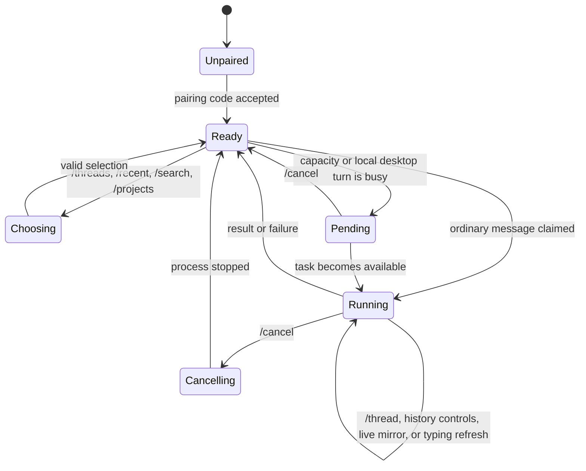
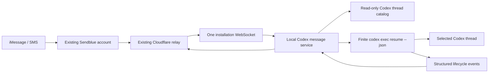

# Codex iMessage Service

## Product and implementation plan

The current presentation contract is the minimal v0.3.7 message grammar.

This alternate version replaces the skill and per-thread Stop hooks with one
user-level local service. It preserves the current Cloudflare relay, Sendblue
account, phone number, webhook, install token, and pairing.

The redesign has two equally important goals:

1. Any visible, unarchived local Codex thread can be reached from one iMessage
   conversation without enabling it first.
2. The conversation feels like a small, coherent Codex client—not a terminal
   protocol exposed through text messages.

No additional third-party service, account, credential, webhook, or manual
provider configuration is required.

## Product principles

### The service owns the interface

Codex should receive the user's actual message, not instructions about how to
behave over iMessage.

The service must not insert:

- hook prompts;
- synthetic system instructions;
- local display blocks;
- formatting instructions;
- progress-update commands;
- pairing or delivery details; or
- instructions to repeat or suppress parts of the user's message.

For a text-only message, the exact inbound text is passed to the selected Codex
thread through stdin. Images are attached with supported Codex CLI image flags.
The resulting user turn and assistant answer remain normal, clean Codex history.

Navigation, typing, progress, context labels, menus, delivery, and errors are
service behavior. The model is never asked to implement the transport UI.

### Every outbound message has a clear source with minimal chrome

The user must be able to distinguish three message classes immediately:

- **Active-thread conversation** — the mirrored user message or visible Codex
  content in the currently selected task.
- **Background or service state** — a result from another task, a connection
  transition, queueing, cancellation, or an actionable error.
- **Menus** — choices or short command help that require user input.

This distinction does not require a repeated masthead or active-task footer.
The selected task is established once by its `Opened` acknowledgement. After
that, active-thread assistant commentary and final output are content only.
Mirrored local user messages use `👤`; transcript views use `👤` and `☁️`.
Background thread content names its source once before the body. Service state
uses a short plain sentence with a targeted state symbol when useful.

Every real project and task receives one pseudo-random, deterministic object
emoji derived from its normalized name and canonical start date. A task uses its
thread creation date. A project uses the earliest known creation date among all
of its catalog tasks, not only tasks visible in the current 48-hour menu. The
emoji is identity, not state, and separate project/task namespaces avoid
coupling the two palettes. The synthetic `Other tasks` group has no project
emoji.

### Quiet by default

- Use the native typing indicator instead of sending “working” messages for
  ordinary turns.
- Show commands only when requested or when the user needs to make a choice.
- Do not append general help text to normal thread responses.
- Do not append a universal header, line rule, or active-context footer.
- Do not announce internal reconnects, catalog syncs, retries, or process IDs.
- Use structured progress to maintain native typing; do not emit progress
  bubbles.
- Keep failures actionable and specific.

### Plain-text first

Formatting must remain readable in iMessage and SMS fallback. Literal Markdown
markers such as `**Project**` are preserved in the Sendblue body. They provide a
clear plain-text hierarchy now and may render as styling in a future client, but
the interface cannot depend on rendering, custom fonts, reactions, carousels,
or link previews. Rich media can enhance a result but cannot be required to
understand or control the service.

## Conversation language

### General grammar

- Do not add a universal header, footer, timestamp, line rule, or help block.
- Use Markdown bold only for selected/source identities and menu hierarchy.
- Use object emoji only as deterministic project/task identity.
- Use `◷`, `○`, and `▲` only where a state needs to be scanned in a list or a
  short service notice.
- Deliver semantic sections as separate messages. Only split a semantic message
  when it exceeds the provider limit; those parts use the minimal `(1/N)`
  marker and never repeat surrounding chrome.
- Presentation text is produced outside Codex history.

### Help

```text
**Browse**
/threads · Tasks by project
/refresh · Refresh the task list
/search (query) · Find a task
/projects · Browse all projects

**Active task**
/thread · Status and latest response
/turn · Show current or last turn
/history (length) · Completed turn history
/reasoning (level/none) · View or change reasoning
/cancel · Stop iMessage-started work in current thread
```

### Thread directory

```text
▾  ⚙️ **iMessage handoff** · 2 tasks

**Selected**
1️⃣  🧪 **Polish message formatting**
   ◷ Working for 4m
   “Show a full example set of every message type.”

2️⃣  ✏️ Fix duplicate fork history
   ◷ Working for 8m · 2 queued
   “Prevent inherited history from replaying.”

▾ **Other tasks** · 1 task

3️⃣  🧲 Compare messaging providers
   ○ 3h ago · 50 turns
   “Which provider supports richer iMessage interactions?”

Reply with a number to open that thread. Add “1 (message)” to directly message the thread.
“/projects” - See all projects
“/search” - Show threads with specific text
```

The menu is a stable snapshot. Its numbering must not reorder while the user is
choosing. A snapshot expires after ten minutes; an expired selection asks the
local service for a fresh menu rather than switching to the wrong task.

Build the directory locally on demand. For each project, show every task with
pending work first, then every remaining task whose actual latest rollout turn
is within 48 hours. Omit projects without a qualifying task. Codex tasks listed
in `projectless-thread-ids` share a final `Other tasks` section. Every task row
shows a short, single-line preview of its newest user request. Idle rows include
live recency and the locally derived turn count; truncated history uses a lower
bound such as `50+ turns`. Send previews transiently for delivery and persist
only the ordered task IDs used by numeric selection.

Additional recent projects may be shown collapsed with `▸` to expand reach
without bloating the initial menu. `/projects` and `/search` use the same
minimal heading, spacing, identity, status, and selection grammar.

Do not show raw thread IDs, full filesystem paths, model names, or absolute
timestamps unless the user explicitly asks for diagnostic information.

### Opening and active-thread conversation

Opening a task sends exactly one acknowledgement:

```text
Opened  🧪 **Polish message formatting**
/reasoning (level/none) · /turn · /history · /cancel
```

Switching does not run Codex and does not generate a model response. It reads
the selected rollout locally. The opening acknowledgement is followed by the
relevant transcript content as separate messages: idle tasks show the complete
final response from the last turn; working tasks show the latest request and
every user-visible assistant message produced in the current turn so far.

`/thread` adds one compact status message before those transcript messages:

```text
🧪 **Polish message formatting**
◷ Working for 4m · 2 queued
Reasoning: high
```

Once open, local user messages are mirrored as:

```text
👤 Please rerun the tests after that change.
```

Visible assistant commentary and final responses contain only their content:

```text
I found the failing assertion.

I’m checking its callers now.
```

Consecutive assistant commentary in the same visible reasoning/update bucket is
joined with blank lines. A user message, final answer, task boundary, or rollback
ends the bucket. Hidden chain-of-thought, tool output, hooks, system/developer
messages, and secrets are never mirrored.

If the user sends `2 run the tests`, `2 (run the tests)`, or the legacy
`2: run the tests` while a menu snapshot is active, the service switches and
submits the message in one action. A bare number opens the item.

When Codex moves the selected task into a locally created active fork, the
service follows that descendant with a compare-and-swap that cannot overwrite a
manual Messages selection. It sends one `Opened` acknowledgement and the
current-turn snapshot, then continues the content-only live feed. Existing fork
history is baselined, so inherited parent turns are not replayed.

### Turn and history views

`/turn` and `/history` send one long message containing only role-marked content,
with three newlines between blocks:

```text
👤 Normalize all album fields.


☁️ I updated the parser and started the tests.


👤 Also preserve unknown fields.


☁️ Done. All tests pass.
```

There is no transcript heading, timestamp, identity footer, or command list.

### Background thread notifications

A completion or notice from a task other than the selected task names its source
once and does not imply a context switch:

```text
✏️ **Fix duplicate fork history**

All tests pass.
```

A selected-task completion contains only the result body. Existing task history
is baselined silently on first start, and iMessage-started turns are deduplicated
so the requested reply is never followed by a second completion notice.

### Reasoning

`/reasoning` renders a minimal selector:

```text
**Reasoning**
○ none
○ low
○ medium
● high
○ xhigh

/reasoning (level/none)
```

`/reasoning high` stores a private task-specific invocation override and replies
`Reasoning set to **high**.`. `/reasoning none` removes that override and returns
the task to its normal default. The available rows follow the task model's
reported capabilities. This does not change global Codex configuration.

### Connection, typing, and service notices

For normal work, send a read receipt and maintain the native typing indicator.
Structured progress updates typing state only and do not create chat bubbles.
Always stop typing on success, failure, cancellation, or process exit.

When the paired user has sent an inbound message within the previous 24 hours,
debounced service presence transitions use only:

```text
● Codex is online.
```

```text
○ Codex is offline. New messages will wait until it reconnects.
```

Inbound prompts, commands, menu choices, media, and pairing refresh this window;
outbound notices do not.

Queue, cancellation, and error notices are one or two actionable sentences with
no universal wrapper. If the notice concerns another task, it uses the same
source-title prefix as a background completion. Do not expose stack traces,
HTTP codes, database terminology, Cloudflare details, child-process output, or
raw progress data in normal messages.

### Commands

Commands use a `/` prefix so ordinary messages such as “status” or “threads” can
still be sent naturally to Codex. Continue accepting the old bare `threads`
command as a compatibility alias.

Supported commands:

```text
/threads          pending tasks plus turns from the last 48 hours
/recent           compatibility alias for /threads
/search words     find tasks by title or project
/projects         browse by project
/refresh          rebuild the grouped directory
/thread           selected task status and latest response
/request          complete latest user request
/turn             complete current or last turn
/history [count]  completed request/final-response history
/reasoning [level|none] inspect, set, or clear the task reasoning override
/status           alias for /thread
/retry            retry the last failed iMessage request
/dismiss          dismiss the oldest failed iMessage request
/cancel           cancel the service-owned run or queued message
/help             command summary
```

Unknown `/commands` show a concise correction and the minimal help menu. Unknown
ordinary text always goes to the selected Codex task.

## Interaction state machine



Important parsing rules:

1. Slash commands are parsed before thread input.
2. A bare number is a selection only while a valid menu snapshot exists.
3. `<number> <message>`, `<number> (<message>)`, and the legacy
   `<number>: <message>` are special only while that snapshot exists.
4. Otherwise, the complete text is passed unchanged to the selected thread.
5. Service messages never enter Codex history.

## Architecture



### Local service

Add a `service/` TypeScript workspace package for Node 20+.

Responsibilities:

- run as a user service, never as a Codex skill or hook;
- read the Codex thread catalog in read-only mode;
- synchronize visible, unarchived metadata with the relay;
- maintain one authenticated installation WebSocket;
- validate and lease inbound work;
- resolve the destination thread and working directory locally;
- download bounded image attachments to private local state;
- pass the exact user text over stdin to:

  ```text
  codex exec resume --json --output-last-message <temporary-file> <thread-id> -
  ```

- attach images with repeated supported image arguments;
- parse lifecycle events without copying private tool output into logs;
- publish typed progress, completion, cancellation, and failure events;
- exit each Codex child process after the turn completes; and
- remain as a small idle event listener between requests.

The Codex boundary is isolated behind an adapter:

```ts
interface CodexAdapter {
  listThreads(): Promise<CodexThreadSummary[]>;
  getThread(id: string): Promise<CodexThreadSummary | null>;
  isRunnable(id: string): Promise<boolean>;
  resume(request: ResumeRequest): AsyncIterable<CodexRunEvent>;
}
```

### Presentation layer

Add a shared, pure presentation module consumed by the relay and local service:

```text
protocol/
  messages.ts
  presentation.ts
  schemas/
```

Logical outbound events are typed rather than preformatted strings:

```ts
type OutboundEvent =
  | { kind: "thread.output"; thread: ThreadLabel; body: string }
  | { kind: "thread.progress"; thread: ThreadLabel; phase: SafePhase }
  | { kind: "service.menu"; menu: MenuSnapshot }
  | { kind: "service.switched"; thread: ThreadLabel }
  | { kind: "service.notice"; code: NoticeCode; detail?: string };
```

The relay renders the final Sendblue payload. This ensures pairing messages,
menus, typing state, and thread output use one grammar. Snapshot tests cover
every message in both iMessage and SMS-safe form, including literal Markdown
preservation.

Model output is data inside `thread.output`; it can never choose a service
identity line or imitate a control message through transport metadata.

### Relay protocol

Keep the existing webhook and thread data plane. Add:

```text
POST /service/register
PUT  /service/catalog
GET  /service/events                 WebSocket
GET  /service/status
POST /service/events/outbound
```

All routes use the existing bearer install token.

- `register` advertises client capabilities and returns pairing state.
- `catalog` synchronizes bounded thread and project labels without conversation
  content, previews, full paths, or git remotes.
- `events` emits IDs and routing metadata, not prompt bodies.
- existing authenticated claim endpoints return prompt/media only when the
  service is ready to run them.
- `events/outbound` accepts typed presentation events and applies rate limits,
  authorization, formatting, splitting, and Sendblue delivery.

Retain these existing execution routes during migration:

```text
POST /threads/:threadId/replies/:replyId/claim
POST /threads/:threadId/status
GET  /threads/:threadId
POST /threads/:threadId/stop
```

### Relay state

Extend the Durable Object with owner-level subscribers. Notify one installation
socket when a reply is buffered for any thread. Existing thread sockets remain
only as a temporary compatibility path.

Inbound message bodies stay in the in-memory reply buffer only until the live
service immediately claims and saves them privately, then are scrubbed. D1
stores routing and presentation metadata only.

Add metadata tables for service installations, installation-level pairing, and
stable menu snapshots. Extend thread rows with catalog visibility, project
label, canonical creation time, and last-seen timestamps. Preserve existing
phone bindings so paired users do not re-pair.

## Thread discovery

Default scope is all visible, unarchived local Codex threads. No opt-in per
thread is required.

Catalog rules:

- synchronize title, short project label, created/updated time, visibility, and
  archived state;
- derive each task identity from normalized title plus canonical creation time,
  and each project identity from normalized label plus the earliest creation
  time among all known project tasks;
- keep full paths and conversation previews out of D1; read previews locally
  only for an on-demand directory;
- include all tasks with pending work, then turns from the last 48 hours;
- remove spawned subagent sessions using `thread_spawn_edges` plus legacy
  source fallbacks;
- deduplicate strictly by canonical thread ID and never by title or path;
- group project tasks using Codex's `thread-workspace-root-hints` and collect
  `projectless-thread-ids` into one final Other tasks section;
- exclude empty placeholder sessions;
- hide catalog rows omitted by each complete replacement snapshot;
- support up to 500 top-level recent tasks;
- paginate and search locally before returning compact menus.

Selecting a thread updates the existing phone binding's active thread. Catalog
refreshes never change selection.

## Execution and concurrency

- One active remote turn per thread.
- A small installation-wide concurrency bound permits distinct tasks to run
  together while preserving one active turn per task.
- Messages remain queued in the relay until leased.
- Service-owned locks prevent duplicate local execution.
- Codex lock/conflict exits are classified as busy, not model failures.
- A local desktop turn always takes precedence; remote work waits rather than
  launching a competing turn.
- `/cancel` terminates only the service-owned child process and never archives,
  deletes, or rewrites a thread.
- Relay event IDs and Sendblue external IDs provide idempotency across retries.

If Codex later provides a supported local task API, implement it as a preferred
adapter while retaining CLI fallback.

## Installation and migration

The CLI becomes service-oriented:

```text
imessage-handoff service install
imessage-handoff service start
imessage-handoff service stop
imessage-handoff service status
imessage-handoff service pause
imessage-handoff service uninstall
```

On macOS, `install` creates a user LaunchAgent with no root privileges. A
foreground `service run` command supports development.

Upgrade flow:

1. Import the existing relay URL and install token.
2. Confirm the existing phone binding and pairing.
3. Start the service and establish its owner-level WebSocket.
4. Synchronize the initial thread catalog.
5. Switch the owner to service delivery.
6. Remove the old iMessage Handoff Stop hook.
7. Remove hook-specific active-thread state and helper prompting scripts after
   the rollback window.

Do not keep a permanent dual-delivery design. A short migration window may
retain legacy endpoints, but the target installation contains no Stop hook,
`publish-stop.js`, `send-update.js`, active-hook state, or skill instructions.

Self-hosted users apply the included D1 migration and deploy the updated Worker.
Their database, domain, Sendblue credentials, webhook URL, number, install token,
and phone pairing remain unchanged.

## Security and privacy

- Preserve install-token authentication and the Sendblue webhook secret.
- Store tokens, locks, temporary results, and media with owner-only permissions.
- Validate thread IDs against the local read-only catalog.
- Derive working directories locally, never from an inbound relay message.
- Pass user text through stdin, never process arguments.
- Bound media size, count, type, and download time.
- Never log prompt bodies, assistant bodies, tokens, media URLs, or raw JSONL
  tool payloads.
- Rate-limit control messages and typing refreshes independently from final
  results.
- A per-task reasoning override may be set for the next iMessage-started turn.
  It is private local service state and is passed as an invocation override;
  `/reasoning none` removes it. Codex SQLite and global config are never edited.
- Do not expose remote controls for model, sandbox, approval mode, project
  rules, task deletion, or task archival.
- Preserve each thread's normal Codex configuration.
- Support local pause, token reset, phone revocation, uninstall, and rollback.

## Repository shape

```text
service/
  src/
    codex/
      adapter.ts
      cli-adapter.ts
      state-store.ts
    relay/
      client.ts
    runner/
      queue.ts
      progress.ts
      turn-runner.ts
    platform/
      launchd.ts
      paths.ts
    cli.ts
    daemon.ts
  tests/
protocol/
  messages.ts
  presentation.ts
  schemas/
relay/
  src/
    worker.ts
    db/migrations/0005_persistent_service.sql … 0008_presentation_metadata.sql
```

## Implementation phases

### Phase 0: interaction contract

- Implement pure renderers for every message class in this document.
- Add golden transcript tests for pairing, menus, switching, ordinary replies,
  long replies, live mirroring, queueing, cancellation, and errors.
- Assert that no renderer adds the retired universal masthead, line rule, or
  active-context footer and that literal Markdown reaches Sendblue unchanged.
- Add parsing tests proving ordinary user text is never mistaken for a command
  outside a valid menu state.
- Add a test proving the exact inbound user body—not a wrapped prompt—reaches
  the Codex adapter.

Exit criterion: the full conversation can be reviewed from fixtures without a
live relay or model.

### Phase 1: local foreground service

- Implement read-only catalog discovery.
- Implement finite `codex exec resume --json` execution.
- Implement leases, locks, attachments, cancellation, and redacted logs.
- Map stable JSONL lifecycle events to typing state and user-visible live
  commentary buckets.
- Run against a mocked installation event stream.

Exit criterion: a mocked iMessage event creates one clean Codex user turn, one
normal assistant turn, and one formatted outbound thread response.

### Phase 2: installation-level relay

- Add service registration, catalog sync, pairing, owner WebSocket, menu
  snapshots, typed outbound events, and presentation rendering.
- Reuse existing claim, phone binding, Sendblue webhook, and status delivery.
- Add thread menu/search/project commands and deterministic selection parsing.

Exit criterion: one connection routes messages to multiple threads and every
outbound bubble matches a golden presentation fixture.

### Phase 3: end-to-end behavior

- Connect the real local service and relay.
- Implement read receipts, typing lifecycle, content-only live mirroring, final
  output, images, cancellation, offline recovery, and deduplication.
- Test desktop/local collision and queued remote work.

Exit criterion: multiple threads can be used sequentially without a hook, and
short tasks produce only typing plus the final response.

### Phase 4: installer and clean migration

- Add LaunchAgent install/status/pause/uninstall commands.
- Import current config and pairing automatically.
- Remove the Stop hook only after service health is confirmed.
- Remove hook prompts and helper scripts from the target install.
- Document rollback without making legacy behavior part of the new UX.

Exit criterion: an existing paired installation upgrades without Sendblue or
Cloudflare configuration and without re-pairing.

### Phase 5: hardening

- Run 24-hour idle and reconnect tests.
- Validate resource and abuse limits.
- Test Codex schema/CLI drift through the adapter boundary.
- Review every user-facing string and golden transcript for clarity and noise.

## Test matrix

- Fresh pairing and existing paired migration.
- Hosted and self-hosted relay configurations.
- 1, 8, 25, 100, and 500 catalog tasks.
- Spawned-subagent filtering without title-based false deduplication.
- All pending tasks, exact 48-hour turn filtering, and a final Other tasks group.
- Duplicate titles across projects.
- Independently routable fork lineages with stable `Fork N` labels, plus
  stable labels for unrelated same-title sessions.
- Stable menu snapshots and expired selections.
- Deterministic project/task emoji from normalized name plus canonical start
  date, including renamed and missing-date cases.
- Slash commands versus identical ordinary words sent to Codex.
- Bare, whitespace, parenthesized, and legacy-colon numeric menu submissions.
- Raw multiline text with no synthetic prompt wrapper.
- Text, image, grouped image, final text, and generated images.
- Short task with typing only.
- Long task with continuous visible commentary and no progress bubble.
- Consecutive assistant-message bucketing and user/final/fork boundaries.
- Success, model failure, tool failure, cancellation, and process crash.
- Service restart before lease, after lease, and after Codex completion.
- Duplicate webhook delivery and WebSocket reconnect.
- Same-thread and cross-thread queues.
- Immediate cancellation/control commands while other turns are running.
- Idle full-final, working current-turn, full-request, turn-history, and
  per-task reasoning views.
- Desktop-local activity colliding with a remote request.
- Archived, deleted, moved, and missing-directory threads.
- Token reset, phone revocation, pause, uninstall, and rollback.
- Literal Markdown preservation, SMS-readable formatting, semantic-message
  separation, and minimal `(i/N)` long-message splitting.
- Logs checked for prompt, response, token, media URL, and raw tool leakage.

## Early technical spikes

1. Verify `codex exec resume --json <thread-id> -` updates a desktop-created
   thread and document lock/conflict behavior.
2. Confirm which JSONL lifecycle events are stable enough for content-only live
   mirroring and typing without exposing hidden reasoning or sensitive tool
   data.
3. Verify generated-image discovery without scanning unrelated session files.
4. Test desktop-local turns while a service-owned resume is running.
5. Validate LaunchAgent PATH, Codex authentication, and `CODEX_HOME` inheritance
   without copying credentials.
6. Confirm Sendblue typing refresh/stop behavior and SMS fallback rendering.

## Definition of done

- No skill, Stop hook, synthetic hook prompt, display block, or model-authored
  progress helper is required.
- No Codex thread waits for iMessage input.
- One local service exposes all visible, unarchived threads by default.
- Existing Sendblue and Cloudflare configuration works unchanged.
- Existing install token and phone pairing migrate without re-pairing.
- Thread menus, project browsing, search, switching, and commands are concise
  and visually consistent.
- Active-thread model output is content only; background output names its source
  exactly once outside Codex history.
- Service state is short and visibly distinct without universal boilerplate.
- Short tasks use native typing and a final response without extra chatter.
- Long tasks mirror user-visible commentary continuously while structured
  progress maintains typing without extra bubbles.
- Project/task identity emoji are deterministic from name plus start date, and
  Markdown markers are preserved literally through Sendblue.
- The exact user message reaches Codex without transport instructions.
- Installation, pause, cancellation, revocation, uninstall, and rollback are
  tested.
