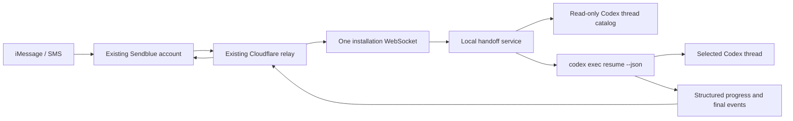

# Persistent iMessage Service Plan

## Status

Proposed alternate architecture for `codex-imessage-handoff`.

The goal is to replace per-thread Codex Stop hooks with one user-level local
service while preserving the existing Cloudflare relay, Sendblue account,
phone number, webhook, install token, and phone pairing.

## Product outcome

After a one-time local install, a paired iMessage conversation can discover and
operate all visible, unarchived local Codex threads without invoking a skill in
each thread. A remote turn starts only when a message arrives and exits when the
turn finishes. No Codex thread is kept alive waiting for input.

The default experience is:

1. Install and start the local service.
2. Reuse an existing relay config and phone pairing, or perform the same pairing
   flow used today.
3. Text `threads` to list recent Codex threads.
4. Reply with a number to select one.
5. Send a prompt. The service resumes that thread, publishes bounded progress,
   forwards the final response, and returns to an idle service process.

No additional third-party service, account, webhook, or credential is required.

## Why the architecture changes

The current implementation connects a WebSocket from a Stop hook running inside
each enabled Codex thread. This has three consequences:

- every remotely reachable thread must be enabled separately;
- a Codex task remains stopped inside a long-running hook while waiting; and
- progress is mostly dependent on the model remembering to invoke a helper.

The relay already owns pairing, phone-to-thread routing, numeric thread
selection, Sendblue delivery, media buffering, and status delivery. Those
contracts can remain. The missing component is an installation-level local
consumer that can receive work for any thread and launch a finite Codex resume
process.

## Proposed architecture



### Local service

Add a `service/` workspace package written in TypeScript for Node 20+.

Responsibilities:

- run as a user process, not a Codex skill or hook;
- read `~/.codex/state_5.sqlite` in read-only mode;
- synchronize visible, unarchived thread metadata with the relay;
- maintain one authenticated installation-level WebSocket;
- claim an inbound reply only when its destination thread can run;
- download inbound attachments to private local state;
- launch a finite process in the thread's recorded working directory:

  ```text
  codex exec resume --json --output-last-message <temporary-file> <thread-id> -
  ```

- pass image attachments with repeated `--image` arguments;
- parse JSONL events for lifecycle and safe progress signals;
- forward the final assistant response and generated images through the existing
  thread status endpoint;
- return to an idle event loop after the child process exits;
- reconnect with bounded exponential backoff and jitter;
- never log prompt bodies, assistant bodies, credentials, or media URLs.

The service should use a small adapter interface around Codex state and process
launching so database or CLI changes are isolated:

```ts
interface CodexAdapter {
  listThreads(): Promise<CodexThreadSummary[]>;
  getThread(id: string): Promise<CodexThreadSummary | null>;
  isRunnable(id: string): Promise<boolean>;
  resume(request: ResumeRequest): AsyncIterable<CodexRunEvent>;
}
```

### Service lifecycle

The package CLI should expose:

```text
imessage-handoff service install
imessage-handoff service start
imessage-handoff service stop
imessage-handoff service restart
imessage-handoff service status
imessage-handoff service logs
imessage-handoff service uninstall
```

On macOS, `install` creates a user LaunchAgent with `KeepAlive` and no root
privileges. Linux systemd user units and Windows user services can follow after
the protocol is stable. A foreground `service run` command supports development
and environments without a service manager.

Service state belongs under `~/.codex/imessage-handoff/`, with files created as
owner-readable only. Existing config at
`~/.codex/skills/imessage-handoff/.state/config.json` is imported once and then
left intact for rollback.

## Relay evolution

The relay remains the only internet-facing component. The existing Sendblue
webhook URL and all Sendblue secrets remain unchanged.

### New authenticated routes

Add routes alongside the existing thread routes:

```text
POST /service/register
PUT  /service/catalog
GET  /service/events                 (WebSocket)
GET  /service/status
```

All routes use the existing bearer install token. The owner ID continues to be
derived from that token; it is not supplied by the client.

`POST /service/register`:

- advertises service version and protocol capabilities;
- marks this installation as service-delivered;
- returns pairing state and, when necessary, a pairing code;
- does not require a thread to be running.

`PUT /service/catalog`:

- accepts bounded batches of thread ID, title, project label, timestamps, and
  archived/visible state;
- is idempotent and versioned;
- never accepts conversation history or message content;
- prunes catalog rows not seen after a retention window;
- does not change the selected thread merely because metadata was refreshed.

`GET /service/events`:

- upgrades to one WebSocket per local installation;
- emits `{ type: "reply-pending", threadId, replyId }`;
- sends catalog refresh requests and health pings;
- does not carry prompt content. Prompt and media are returned only by the
  authenticated claim endpoint.

The existing routes remain the execution data plane:

```text
POST /threads/:threadId/replies/:replyId/claim
POST /threads/:threadId/status
GET  /threads/:threadId
POST /threads/:threadId/stop
```

This minimizes relay and self-host migration risk.

### Durable Object changes

Extend `HandoffSocket` to maintain owner-level subscribers in addition to the
legacy per-thread subscribers. When an inbound reply is buffered, notify the
connected owner service first. Legacy thread sockets remain supported when the
owner has not opted into service delivery.

Only IDs and routing metadata cross the WebSocket. Inbound message bodies remain
in the existing in-memory reply buffer until claimed and are scrubbed after
claim, preserving the current data-minimization model.

### D1 migration

Add metadata-only tables/columns:

```sql
CREATE TABLE service_installations (
  owner_id TEXT PRIMARY KEY,
  delivery_mode TEXT NOT NULL DEFAULT 'service',
  client_id TEXT NOT NULL,
  service_version TEXT NOT NULL,
  capabilities TEXT NOT NULL,
  last_seen_at TEXT NOT NULL,
  created_at TEXT NOT NULL,
  updated_at TEXT NOT NULL
);

CREATE TABLE installation_pairings (
  owner_id TEXT PRIMARY KEY,
  pairing_code TEXT UNIQUE,
  pairing_code_expires_at TEXT,
  created_at TEXT NOT NULL,
  updated_at TEXT NOT NULL
);
```

Extend `handoff_threads` with catalog metadata such as `catalog_source`,
`archived`, `visible`, and `last_seen_at`. Keep existing columns and indexes so
old hooks and current deployments continue to function.

The current hosted limit of 25 enabled handoff threads should become a catalog
policy rather than a hard execution limit. The initial service can synchronize
the 100 most recent visible threads, with pagination/search added before lifting
that limit further.

## Pairing and migration compatibility

Existing users should not reconfigure Sendblue or Cloudflare.

1. The service imports the existing relay URL and install token.
2. The relay recognizes the same owner ID and existing `phone_bindings` row.
3. Existing phone pairing remains valid.
4. Service registration switches that owner to `delivery_mode = 'service'`.
5. The installer removes only the iMessage Handoff Stop hook after the service
   is healthy and the owner WebSocket has connected.
6. Legacy hook endpoints remain available for rollback and older clients.

For a fresh install, installation-level pairing replaces thread-bound pairing.
The user still texts one six-character code to the same Sendblue number. No new
provider setup is introduced.

Self-hosted operators only pull the new code, apply the included D1 migration,
and deploy. Their D1 database, Worker domain, Sendblue secrets, webhook URL, and
phone number do not change.

## Thread discovery and control

Default catalog scope is all visible, unarchived local Codex threads. This meets
the all-threads product goal without exposing archived or placeholder sessions.

The relay continues to support:

```text
threads
<number>
```

Add commands after the basic service is stable:

```text
recent
projects
search <words>
thread <number>: <prompt>
status
cancel
```

Thread titles and a short project label may be synchronized. Full local paths,
prompts, conversation previews, and git remotes should stay local by default.
The current relay `cwd` field can receive the project label for service-managed
catalog rows while legacy registrations preserve their existing behavior.

Optional local policy can exclude roots or individual threads, but no policy
configuration is required for the default all-visible-threads behavior.

## Execution, concurrency, and cancellation

### Queue semantics

- One active remote turn per Codex thread.
- Default maximum of one active Codex child process per installation; make this
  locally configurable later.
- Do not claim a reply until the service can start or durably lease the work.
- Additional messages for a running thread remain queued in the Durable Object.
- Messages for another thread may remain queued or run concurrently according
  to the local concurrency limit.
- Deduplicate Sendblue retries by external message ID as today.

### Local/remote collision

Before resuming, check service-owned locks and the Codex process result. If Codex
reports that a thread is already running or locked, leave the remote reply
pending and send a bounded `thread busy; queued` control message. Never launch a
second turn blindly.

The service cannot initially guarantee coordination with every future Codex app
execution path. The Codex adapter must classify lock/conflict exits separately
from model or tool failures, and the integration test matrix must include a
thread active in the desktop app. If Codex exposes a supported local task API in
the future, add it as a preferred adapter while retaining CLI fallback.

### Cancellation

`cancel` first sends a graceful termination signal to the child process, waits a
short bounded interval, then force-terminates only that service-owned process.
It publishes a cancellation result and does not modify or archive the thread.

## Progress updates

Structured `codex exec --json` output allows progress to be service-driven
instead of prompt-driven.

Initial policy:

- immediately send a typing indicator when a reply is claimed;
- send a short `Started work in <thread>` message only when startup is slow;
- publish at most one progress message every 90 seconds;
- summarize only observable lifecycle events such as tool category, test phase,
  retry, or completion count;
- never expose chain-of-thought, raw commands containing secrets, environment
  values, or unredacted tool output;
- always send the final assistant message through the existing status endpoint;
- stop the typing indicator on completion, failure, or cancellation.

Progress formatting should be deterministic and tested. Model-generated
`send-update.js` calls remain supported only for legacy hook clients.

## Security and privacy

- Preserve the current install-token authentication and webhook signature.
- Store tokens and downloaded media with owner-only filesystem permissions.
- Validate that every requested thread exists in the local read-only catalog.
- Derive `cwd` locally; never trust a relay-supplied working directory.
- Pass prompts through stdin, not process arguments.
- Restrict media downloads by size, count, protocol, and content type.
- Redact secrets and prompt/response content from service logs.
- Use bounded queues, catalog sizes, payloads, and reconnection rates.
- Do not provide a remote command that changes model, reasoning, sandbox, or
  approval policy in the first release.
- Preserve the thread's normal Codex configuration and project rules.
- Provide `service pause` and `service revoke` locally; token reset continues to
  revoke the paired phone.

## Repository shape

```text
service/
  src/
    codex/
      adapter.ts
      cli-adapter.ts
      state-store.ts
    relay/
      client.ts
      protocol.ts
    runner/
      queue.ts
      progress.ts
      turn-runner.ts
    platform/
      launchd.ts
      paths.ts
    cli.ts
    daemon.ts
  tests/
relay/
  src/
    worker.ts
    db/migrations/0005_service_installations.sql
protocol/
  service-events.schema.json
  service-register.schema.json
```

Keep protocol types in a small shared workspace package or generated JSON Schema
so the Worker and Node service validate the same messages without pulling Node
dependencies into the Worker bundle.

## Implementation phases

### Phase 0: contract tests and fixtures

- Capture current register, pairing, thread switch, reply claim, media, status,
  and Stop-hook behavior as compatibility tests.
- Add sanitized Codex JSONL fixtures for success, tool use, generated images,
  cancellation, lock conflict, and failure.
- Add a temporary test-only service token and mock WebSocket harness.

Exit criterion: current skill and relay tests remain green with no behavior
changes.

### Phase 1: local foreground prototype

- Implement read-only thread discovery.
- Implement `codex exec resume --json` adapter and final response extraction.
- Run a foreground service against a mocked relay.
- Add per-thread queueing, locks, attachment handling, and log redaction.

Exit criterion: a mocked inbound event resumes an existing thread, captures its
final response, and exits the child process.

### Phase 2: owner-level relay protocol

- Add D1 migration and service registration/catalog routes.
- Add installation pairing while preserving thread pairing.
- Extend the Durable Object with owner subscribers and fallback delivery.
- Reuse current claim and status endpoints.
- Add catalog-backed `threads` and numeric switching.

Exit criterion: legacy hook tests and new service protocol tests both pass.

### Phase 3: end-to-end service

- Connect the local service to the owner WebSocket.
- Implement catalog synchronization and pairing import.
- Implement safe progress policies, typing, final responses, and media.
- Test offline reconnect, duplicate webhook events, and queued replies.

Exit criterion: one service can operate multiple threads sequentially without
any Stop hook installed.

### Phase 4: installer and migration

- Add macOS LaunchAgent install/status/uninstall commands.
- Import existing config and verify relay health before changing delivery mode.
- Remove the legacy Stop hook only after a successful service heartbeat.
- Add rollback that stops the service and restores legacy delivery if requested.
- Update hosted and self-hosted documentation.

Exit criterion: an existing paired installation upgrades without Cloudflare or
Sendblue configuration and without re-pairing.

### Phase 5: hardening and release

- Soak-test daemon reconnect and process cleanup.
- Add resource and abuse limits.
- Test Codex upgrades and schema drift with adapter compatibility checks.
- Add signed/notarized packaging only if distribution requirements justify it;
  npm plus LaunchAgent is sufficient for the initial release.

Exit criterion: 24-hour idle soak, multi-thread routing, restart recovery, and
rollback tests pass.

## Test matrix

Required automated coverage:

- existing paired and fresh pairing flows;
- hosted and self-hosted relay configs;
- 1, 25, and 100 catalog threads;
- numeric switching and active-thread persistence;
- text, multiline text, image, and grouped-media inputs;
- final text and generated-image outputs;
- Codex success, failure, cancellation, and process crash;
- service restart before claim and after claim;
- relay disconnect and WebSocket replay/deduplication;
- simultaneous messages to one thread and different threads;
- desktop-local activity colliding with a remote request;
- archived/deleted/moved threads;
- missing working directory;
- token reset and revoked phone;
- upgrade from legacy hook mode and rollback to it;
- logs checked for prompt, response, token, and media-URL leakage.

## Early technical spikes

Resolve these before broad implementation:

1. Verify `codex exec resume --json <thread-id> -` updates a desktop-created
   thread consistently and identify its lock/conflict exit behavior.
2. Enumerate stable JSONL event types and determine which can safely drive
   deterministic progress messages.
3. Verify generated-image paths are available through JSONL or the updated
   rollout log without scanning unrelated session files.
4. Test how a desktop-local turn behaves while a service-owned resume is active.
5. Confirm LaunchAgent environment requirements for Codex auth, PATH, and
   `CODEX_HOME` without copying credentials.

## Definition of done

- No iMessage Handoff Stop hook is installed or required.
- No Codex task waits indefinitely for iMessage input.
- One local service exposes all visible, unarchived threads by default.
- Existing Sendblue and Cloudflare configuration works unchanged.
- Existing install token and phone pairing migrate without re-pairing.
- `threads` and numeric switching work across projects.
- Remote prompts resume the selected thread and preserve its normal context.
- Progress and final results are delivered without model-authored update calls.
- Legacy hook clients remain compatible during the migration window.
- Installation, pause, restart, revocation, uninstall, and rollback are tested.
